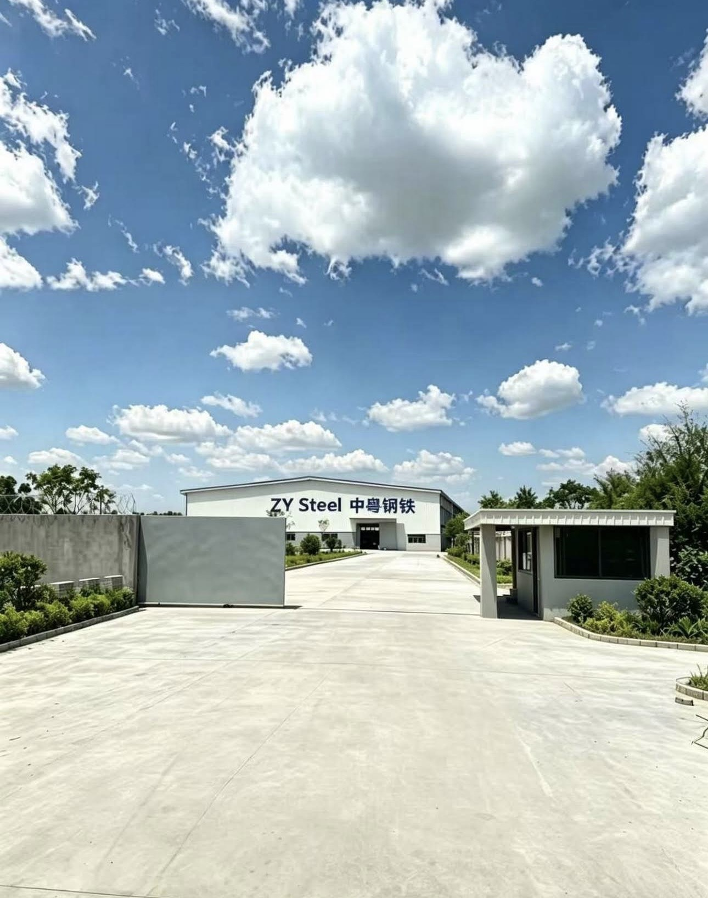

# Performance Report — 中粤铁网公司 / Zhongyu Steel Wire Group
Generated: 2026-06-24

---

## 1. Render-Blocking Resources

### 1.1 Google Fonts Loaded Synchronously

Severity: **HIGH**

`index.html` lines 8–11:

```html
<link rel="preconnect" href="https://fonts.googleapis.com" />
<link rel="preconnect" href="https://fonts.gstatic.com" crossorigin />
<link href="https://fonts.googleapis.com/css2?family=Noto+Sans+SC:wght@400;500;700;900&family=Barlow+Condensed:wght@700;800;900&family=Barlow:wght@400;600;700;800&display=swap" rel="stylesheet" />
<link rel="stylesheet" href="style.css" />
```

The Google Fonts stylesheet is a synchronous `<link rel="stylesheet">` in `<head>`. The browser must:
1. DNS-resolve fonts.googleapis.com (partially mitigated by the `preconnect` hint)
2. Download the Fonts CSS response
3. Parse it, then download the referenced `.woff2` files from fonts.gstatic.com

Until the Fonts CSS is received, the browser's render-blocking parser halts. On slow connections this adds 300–800 ms to First Contentful Paint.

The URL already includes `&display=swap` (appended as part of the query string, visible in the URL), which instructs the browser to use a font-swap strategy at the `@font-face` level, but this does **not** eliminate the render-blocking nature of the stylesheet request itself.

**Fix — non-blocking font loading pattern:**

```html
<link rel="preconnect" href="https://fonts.googleapis.com" />
<link rel="preconnect" href="https://fonts.gstatic.com" crossorigin />
<link rel="preload" as="style"
  href="https://fonts.googleapis.com/css2?family=Noto+Sans+SC:wght@400;500;700;900&family=Barlow+Condensed:wght@700;800;900&family=Barlow:wght@400;600;700;800&display=swap" />
<link rel="stylesheet" media="print"
  href="https://fonts.googleapis.com/css2?family=Noto+Sans+SC:wght@400;500;700;900&family=Barlow+Condensed:wght@700;800;900&family=Barlow:wght@400;600;700;800&display=swap"
  onload="this.media='all'" />
<noscript>
  <link rel="stylesheet"
    href="https://fonts.googleapis.com/css2?family=Noto+Sans+SC:wght@400;500;700;900&family=Barlow+Condensed:wght@700;800;900&family=Barlow:wght@400;600;700;800&display=swap" />
</noscript>
```

The `media="print"` trick forces the browser to treat the stylesheet as non-render-blocking; `onload` switches it to `media="all"` once loaded.

### 1.2 No Preload for Hero Image

Severity: **HIGH**

The hero background image (index.html line 76):

```html

```

is the Largest Contentful Paint (LCP) candidate — the single biggest visible element on first load. It has:
- No `<link rel="preload" as="image">` in `<head>`
- No `fetchpriority="high"` attribute on the ``

Without either hint, the browser does not discover or prioritise this image until it has parsed the HTML, applied CSS (to know the image is displayed), and built the render tree. On a typical connection this delays LCP by 500–1500 ms compared to a preloaded image.

Note: `loading="lazy"` is correctly absent from this image (lazy loading on the LCP image is a separate anti-pattern that would make performance significantly worse). However, `factory-gate.jpg` is 334 KB unoptimised — see Section 3.

**Fix:**

Add to `<head>` before the stylesheet:

```html
<link rel="preload" as="image" href="images/factory-gate.jpg" fetchpriority="high" />
```

And add to the `` tag:

```html

```

---

## 2. Cumulative Layout Shift (CLS)

### 2.1 Images Have No Explicit `width` and `height` Attributes

Severity: **HIGH**

No `` tag in `index.html` has explicit `width` and `height` attributes. The browser cannot reserve space for images before they load, which causes content to shift downward as each image loads — contributing directly to a high CLS score (Google Core Web Vital).

**Affected images (all images in the document):**

- `images/factory-gate.jpg` (hero, line 76) — no width/height
- `images/machine-1.jpg` through `machine-6.jpg` (factory section, lines 547–613) — no width/height
- `images/delivery-1.jpg`, `delivery-2.jpg` (lines 754, 764) — no width/height
- `images/logo.png` (footer, line ~920) — no width/height

**Fix:** Add intrinsic dimensions as attributes. The browser uses `width` and `height` to compute the aspect ratio and reserve space even before the image loads:

```html

```

CSS `width: 100%; height: auto;` on the element will override visual sizing while the attribute-defined aspect ratio prevents layout shift.

---

## 3. Unoptimised Images

Severity: **HIGH**

The `images/` directory contains 19 files with a combined size of approximately 53 MB. This is the dominant performance problem on the site.

| File | Size | Issue |
|---|---|---|
| `delivery-1.jpg` | 4.6 MB | Uncompressed, no WebP variant |
| `delivery-2.jpg` | 4.0 MB | Uncompressed, no WebP variant |
| `product-5.jpg` | 4.9 MB | Uncompressed, no WebP variant |
| `product-4.jpg` | 5.2 MB | Uncompressed, no WebP variant |
| `product-1.jpg` | 5.0 MB | Uncompressed, no WebP variant |
| `machine-1.jpg`–`machine-6.jpg` | 2.9–3.4 MB each | Uncompressed, no WebP variant |
| `logo.png` | 1.3 MB | PNG logo — should be SVG or <50 KB WebP |
| `factory-gate.jpg` | 334 KB | Hero LCP image — reasonable but convertible to WebP (~100 KB) |

A visitor who scrolls through the entire site would download up to 53 MB of images. Even with `loading="lazy"` on below-fold images, the product and machine gallery sections will trigger multi-megabyte downloads as they enter the viewport.

**Fix:**
1. Convert all JPEGs to WebP at 80–85% quality. Expected size reduction: 60–75% per file.
2. Use `<picture>` with a WebP source and JPEG fallback, or serve WebP via a Cloudflare Image Resizing transform.
3. Serve images at appropriate sizes for the display context (e.g., gallery thumbnails do not need 3000×4000 pixel originals).
4. Consider `srcset` + `sizes` for responsive serving.
5. Replace `logo.png` (1.3 MB) with an SVG or a heavily compressed WebP under 30 KB.

---

## 4. Continuous `requestAnimationFrame` Loops Without Pause

Severity: **MEDIUM**

Two canvas animations run continuous, never-pausing `requestAnimationFrame` loops:

**Canvas 1 — About section steel-wire grid (script.js lines 400–426):**

```js
function drawAboutBg() {
  ctx.clearRect(0, 0, W, H);
  t += 0.008;
  // ... draws 18×12 = 216 line segments + 247 dots on every frame
  requestAnimationFrame(drawAboutBg);
}
drawAboutBg(); // starts immediately at DOM ready
```

**Canvas 2 — Photo sparks particle system (script.js lines 456–479):**

```js
function drawAboutSparks() {
  ctx.clearRect(0, 0, W, H);
  if (Math.random() < 0.35) spawn();
  // ... iterates and draws all live sparks
  requestAnimationFrame(drawAboutSparks);
}
drawAboutSparks(); // starts immediately at DOM ready
```

Both loops start as soon as the DOM is ready and never stop — not when the about section is scrolled out of view, not when the tab is backgrounded (though the browser throttles rAF in background tabs), and not when the user is viewing a completely different section.

On a typical 60 Hz display this is 60 canvas draw operations per second for every second the page is open, regardless of whether the canvas is visible. On a 120 Hz display it is 120 draws per second.

**Fix:** Wrap both canvases with `IntersectionObserver`. Start the rAF loop when the canvas enters the viewport; cancel it (via `cancelAnimationFrame`) when it leaves:

```js
let rafId;
const observer = new IntersectionObserver((entries) => {
  if (entries[0].isIntersecting) {
    rafId = requestAnimationFrame(drawAboutBg);
  } else {
    cancelAnimationFrame(rafId);
  }
}, { threshold: 0.01 });
observer.observe(canvas);
```

Also add a `document.addEventListener('visibilitychange')` handler to pause when the tab is hidden.

---

## 5. Lenis Deprecated Option

Severity: **MEDIUM**

`script.js` line 309:

```js
lenis = new Lenis({
  duration: 1.2,
  easing: function (t) { return Math.min(1, 1.001 - Math.pow(2, -10 * t)); },
  smooth: true,  // DEPRECATED in Lenis v1.x
});
```

The `smooth: true` option was the legacy Lenis v0.x API. In Lenis v1.x and above, smooth scrolling is always enabled and the option is ignored with a deprecation warning in the console. More importantly, the `easing` option has also changed in Lenis v1.1+ — the `duration` + `easing` pair has been superseded by `lerp` (a number between 0 and 1 representing interpolation speed).

While the current code is functionally harmless (ignored options do not crash), it signals that the Lenis integration was written against an older API version and may break silently when the CDN delivers a future major version.

**Fix:** Update to the current Lenis API:

```js
lenis = new Lenis({
  lerp: 0.08,  // replaces duration + easing
});
```

---

## 6. `loading="lazy"` Applied Correctly — One Note

Severity: **LOW** (informational)

All below-fold images correctly use `loading="lazy"` (machine images lines 547–613, delivery images lines 754–764). The hero image (line 76) correctly does NOT have `loading="lazy"`, which is the correct behaviour — lazy loading the LCP image is a known performance anti-pattern.

No action required on this specific point, but it is noted because adding `fetchpriority="high"` (see Section 1.2) would further improve LCP independently of the lazy loading.

---

## 7. GSAP and ScrollTrigger Loaded from CDN Without Deferral

Severity: **MEDIUM**

`index.html` loads GSAP from CDN via `<script src="...">` tags (presumably at the bottom of `<body>` or before `script.js`). If these are in `<head>` without `defer` or `async`, they are also render-blocking. If GSAP is unavailable (CDN outage, network failure), `script.js` line 343 guards against crashes (`if (typeof gsap === 'undefined') return;`), but all scroll animations — including the ones that restore `opacity: 0` elements on sections like `.about-feat-row`, `.testi-card`, `.product-card` — will never fire, leaving those sections invisible.

Without visibility into the exact script tag positions, the worst-case scenario is render-blocking GSAP CDN requests in `<head>`. Minimum fix: ensure all CDN script tags have `defer` or are placed at the end of `<body>`.

---

## 8. No HTTP Caching Headers Defined at Asset Level

Severity: **LOW** (deployment-dependent)

Because there is no build pipeline and asset filenames are not content-hashed (e.g., `style.css` rather than `style.a3f9c2.css`), it is not possible to set long-lived cache headers (`Cache-Control: max-age=31536000, immutable`) safely. Any change to `style.css` or `script.js` requires users to make a new request. Without explicit short-lived headers from the server, browsers may cache these files using their heuristic expiry, causing some users to see outdated content after deployments.

**Fix:** Introduce filename content hashing via a build step, then configure the CDN/server to serve `style.[hash].css` with a one-year `max-age`. HTML itself should be served with `Cache-Control: no-cache`.

---

## 9. Summary of Severity Ratings

| # | Issue | Severity |
|---|---|---|
| 1 | Google Fonts loaded as synchronous render-blocking stylesheet | HIGH |
| 2 | Hero LCP image has no preload or fetchpriority="high" | HIGH |
| 3 | No width/height on any img element — causes CLS | HIGH |
| 4 | 19 unoptimised images totalling ~53 MB, no WebP | HIGH |
| 5 | Two canvas rAF loops run continuously with no IntersectionObserver pause | MEDIUM |
| 6 | Lenis initialised with deprecated `smooth: true` option | MEDIUM |
| 7 | GSAP CDN scripts — deferral strategy unverified; CDN failure hides content | MEDIUM |
| 8 | No content-hashed filenames — no long-lived caching possible | LOW |
| 9 | loading="lazy" applied correctly on below-fold images (no action needed) | LOW (info) |
